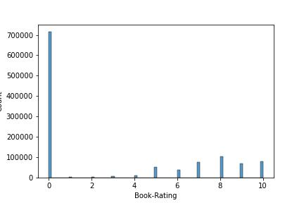
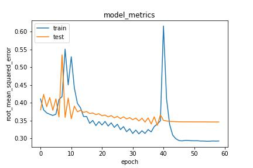

# Laporan Proyek Machine Learning - Norman Dwi Febrio

## Project Overview

Pepatah mengatakan, "Buku adalah jendela dunia". Dalam kalimat ini terkandung kebijaksanaan bahwa membaca buku dapat membuka cakrawala pengetahuan dan memperluas wawasan seseorang tentang dunia ini. Bahkan, salah satu pahlawan Indonesia, Bung Hatta, mengungkapkan bahwa dia bersedia dipenjara selama ada buku bersamanya. Bagi beliau, buku adalah jendela dan celah untuk menjelajahi dunia dan mempelajari segala hal ([okenews, 2021](https://nasional.okezone.com/read/2021/08/14/337/2455555/kecintaan-bung-hatta-terhadap-buku-rela-dipenjara-asalkan-bersama-buku)).

Meskipun begitu, minat baca di Indonesia masih tergolong rendah jika dibandingkan dengan negara-negara lain. Menurut survei PISA 2018 yang dilaporkan oleh [DPR-RI (2023)](https://www.dpr.go.id/berita/detail/id/44041/t/Ini%20Alasan%20Syaiful%20Huda%20Prihatin%20dengan%20Indeks%20Literasi%20Indonesia), Indonesia berada di peringkat 74 dari 79 negara. Indeks Pembangunan Literasi Masyarakat (IPLM) tahun 2022 mencatatkan skor Indonesia sebesar 64,48 dari skala 1-100, mencerminkan perlunya peningkatan minat baca di negara ini. 

Untuk meningkatkan minat baca, tentunya diperlukan sistem yang dapat merekomendasikan buku sesuai dengan ketertarikan dari pembaca. Salah satu cara untuk mewujudkannya adalah dengan menggunakan sistem rekomendasi. Sistem rekomendasi adalah sebuah sistem yang dapat memberikan apa yang mungkin disukai oleh pengguna.

### Mengapa Proyek Ini Penting Untuk Diselesaikan

Berdasarkan data mengenai minat baca masyarakat Indonesia yang telah disebutkan di atas, perlu lebih ditegaskan lagi untuk meningkatkan minat baca di Indonesia. Dampak rendahnya minat baca tidak hanya terbatas pada tingkat individu, tetapi juga mempengaruhi kemampuan masyarakat dalam memahami informasi, berpikir kritis, dan berpartisipasi aktif dalam kehidupan sosial. Oleh karena itu, penggunaan sistem rekomendasi buku dapat menjadi langkah efektif untuk meningkatkan minat baca dengan memberikan rekomendasi yang sesuai dengan preferensi pembaca. Dengan mengatasi masalah ini, Indonesia dapat menciptakan masyarakat yang lebih tertarik untuk membaca, berpengetahuan luas, dan siap menghadapi kompleksitas tantangan global. 

## Business Understanding

### Problem Statements

Minat baca yang rendah di kalangan masyarakat Indonesia menjadi masalah serius yang perlu diatasi. Meskipun buku dianggap sebagai jendela dunia dan sumber pengetahuan, minat baca yang rendah menghambat akses ke pengetahuan dan informasi yang luas. Kondisi ini juga mempengaruhi perkembangan literasi dan kemampuan belajar masyarakat. Oleh karena itu, meningkatkan minat baca di Indonesia menjadi tantangan utama.

1. Bagaimana cara meningkatkan minat baca masyarakat?
2. Bagaimana cara mendukung penulis buku?

### Goals

Tujuan dari proyek ini adalah:

1. Meningkatkan Minat Baca: Memperkenalkan pembaca dengan buku-buku yang sesuai dengan minat dan preferensi mereka untuk meningkatkan minat baca secara keseluruhan.
2. Mendukung Penulis Buku: Memberdayakan penulis buku dengan cara meningkatkan penjualan bukunya.

### Solution Approach

Untuk mencapai tujuan dari proyek ini, diperlukan sistem rekomendasi yang dapat memberikan rekomendasi buku pada pembaca. Sistem rekomendasi tersebut dibangun menggunakan dua metode, yaitu *Content-based Filtering* dan *Collaborative Filtering*. *Content-based Filtering* berguna untuk merekomendasikan buku pada pembaca sesuai dengan penulis dari buku yang telah ia baca.  Sedangkan untuk *Collaborative Filtering* berguna untuk merekomendasikan buku pada pembaca sesuai dengan *rating* yang telah pembaca beri pada buku yang telah ia baca.

Metrik evaluasi yang akan digunakan pada proyek ini adalah *cosine similarity* untuk *Content-based Filtering* dan *Root Mean Squared Error* (RMSE) untuk *Collaborative Filtering*. *Cosine similarity* digunakan pada metode *Content-based Filtering* untuk mengukur tingkat kesamaan buku berdasarkan penulis dari buku tersebut. Sedangkan RMSE digunakan pada metode *Collaborative Filtering* untuk memprediksi nilai peringkat atau skor yang diberikan oleh pengguna terhadap buku tertentu. 

## Data Understanding

Dataset yang digunakan didownload dari Kaggle dengan judul dataset "Book Recommendation Dataset". Dataset ini terdiri dari 3 file csv, yaitu 'Books.csv', 'Ratings.csv', dan 'Users.csv'. Klik [di sini](https://www.kaggle.com/datasets/arashnic/book-recommendation-dataset) untuk mendapatkan dataset yang digunakan.

Users
- Berisi informasi mengenai ID, lokasi, dan usia pengguna.

Books
- Berisi informasi mengenai ISBN, judul buku, penulis buku, tahun terbit, penerbit, dan link gambar buku. Buku diidentifikasi dengan ISBN masing-masing. ISBN yang tidak valid telah dihapus dari kumpulan data. 

Ratings
- Berisi informasi mengenai ID pengguna, ISBN, dan *rating* oleh pengguna. *rating* yang disediakan berupa *rating* secara eksplisit (skala 1 - 10) dan *rating* secara implisit (0).

Setelah dilakukan eksplorasi pada tiap dataset, berikut apa yang telah didapatkan:

**Books**
- Terdapat total 271360 data
- Terdapat nilai *null* pada fitur 'Book-Author', 'Publisher', dan 'Image-URL-L'.
- Terdapat kesalahan tipe data pada fitur 'Year-Of-Publication' yang mana seharusnya bertipe data *integer*.
- Terdapat 102023 penulis buku.
- Terdapat 16807 penerbit buku.
- Terdapat kesalahan input data pada fitur 'Year-Of-Publication' dan 'Publisher'.

**Ratings**
- Terdapat total 1149780 *rating* dari seluruh pengguna.
- Berdasarkan penjelasan dari pemilik dataset, *rating* ini terdiri dari *rating* eksplisit dan implisit. *rating* eksplisit adalah *rating* dengan nilai 1 - 10. *rating* implisit adalah *rating* dengan nilai 0.

Gambar 1. Distribusi *rating* Oleh Pengguna

Pada Gambar 1, diketahui bahwa para pengguna banyak yang membaca suatu buku tetapi tidak melakukan penilaian pada buku tersebut. Inilah yang disebut dengan *rating* secara implisit. Kemudian untuk *rating* yang secara eksplisit, pembaca lebih sering menilai buku di antara nilai 5 - 10.

**Users**
- Terdapat total 278858 pengguna
- Terdapat nilai *null* pada variabel "Age" dan tipe datanya adalah float64, seharusnya adalah int64.

## Data Preparation

### Books

#### Menghapus Fitur yang Tidak Diperlukan

Pada dataset ini, variabel yang akan digunakan untuk sistem rekomendasi adalah ISBN, judul buku, penulis buku, dan penerbit buku. Oleh karena itu, kita akan menghapus variabel yang tidak digunakan. Hal ini dilakukan untuk mengurangi dimensionalitas dari dataset.

Fungsi yang digunakan untuk melakukan tahapan ini adalah fungsi **drop** dari *Pandas DataFrame*. Fungsi ini berguna untuk menghapus atau mengeliminasi data yang sesuai dengan yang disebutkan pada parameternya. Karena yang ingin dihapus pada tahapan ini adalah fitur "Image-URL-S", "Image-URL-M", dan "Image-URL-L", maka ketiga fitur tersebut ditulis dalam sebuah list untuk dijadikan sebagai nilai pada parameter pertama pada fungsi *drop*. Kemudian, karena yang ingin dihapus adalah fitur, maka pada parameter "axis" nilai yang diberikan adalah 1, bukan 0.

#### Menghapus nilai *null* pada variabel Book-Author

Dataset ini memiliki nilai *null* sebanyak 3 baris padafitur 'Book-Author'. Jika data ini tidak dihapus, maka sistem rekomedasi tidak akan dapat berjalan dengan baik karena kurangnya informasi yang diberikan. Oleh karena itu, akan lebih baik jika data yang memiliki nilai *null* dihapus saja. 

Fungsi yang digunakan pada tahapan ini adalah fungsi **dropna** dari *Pandas DataFrame*. Fungsi ini berguna untuk mengeliminasi data yang memiliki nilai *null*. Parameter yang digunakan pada fungsi ini adalah "how", "axis", dan "inplace". Pada parameter "how", nilai yang diberikan adalah "any" karena nilai *null* hanya terdapat pada salah satu fitur, yaitu fitur penulis buku. Jika ada nilai *null* pada fitur penulis buku, maka semua data pada baris tersebut akan dihapus. Kemudian nilai pada parameter "axis" adalah 0 karena yang ingin dihapus adalah baris, bukan fitur. Dan untuk parameter "inplace", nilai yang diberikan adalah "True" karena tahapan ini ingin langsung disimpan dalam variabel "new_books".

#### Memperbaiki kesalahan input data

Terdapat 3 buku yang salah dalam input data. Data yang seharusnya tahun terbit tetapi terinput dalam fitur 'Publisher'. Begitupun sebaliknya. Hal ini tentunya akan mengakibatkan misinformasi jika tidak diperbaiki. Oleh karena itu, diperlukan pertukaran nilai antar kedua fitur ini pada data yang memiliki kesalahan input.

`new_books.loc[new_books["ISBN"]=="078946697X", "Book-Author"] = "DK Publishing Inc"`

Kode tersebut akan melakukan perubahan nilai dengan cara memilih baris yang memiliki nilai ISBN sama dengan 078946697X. Kemudian pada baris tersebut, fitur yang akan diakses adalah fitur "Book-Author". Pada baris inilah nilai dari fitur penulis buku akan diubah menjadi nilai yang baru, yaitu "DK Publishing Inc".

#### Mengubah tipe data tahun terbit

Fitur 'Year-Of-Publication' adalah data kategorikal ordinal. Oleh karena itu, kita perlu merubah tipe data dari fitur ini menjadi *integer*. Fungsi yang digunakan adalah fungsi **astype()** dari *Pandas DataFrame*. Fungsi ini berguna untuk merubah tipe data dari suatu fitur. Karena tipe data dari fitur 'Year-Of-Publication' ingin diubah menjadi *integer*, maka nilai yang diberikan pada fungsi **astype** adalah "int64".

#### Menyesuaikan tahun terbit buku

Dataset ini dibuat pada tahun 2004. Jadi, buku yang tahun terbitnya lebih dari 2004 atau buku yang tahun terbitnya 0 akan diubah dengan rata-rata tahun terbit buku semua buku yang ada.

`new_books["Year-Of-Publication"] = new_books["Year-Of-Publication"].apply(lambda x: avg_year if ((x == 0) | (x > 2004)) else x )`

Kode di atas akan melakukan penggantian nilai pada fitur "Year-Of-Publication". Fungsi yang digunakan adalah **apply** dari *Pandas DataFrame*. `lambda x` merepresentasikan bahwa x adalah nilai saat ini. Sedangkan `avg_year if ((x == 0) | (x > 2004)) else x` merupakan nilai yang akan menggantikan x. Arti dari kode nilai pengganti tersebut adalah x akan diganti dengan rata-rata tahun terbit jika nilai x adalah sama dengan 0 atau lebih dari 2004. Dan jika kondisi tersebut tidak terpenuhi, maka x akan tetap (tidak diganti).

#### Pengurangan Data yang Akan Digunakan dalam Sistem Rekomendasi

Dataset ini terdiri dari 270k++ data buku. Jika dataset ini digunakan seluruhnya, akan membutuhkan waktu komputasi yang cukup lama dan juga berpeluang untuk mengalami "Out of Memory". Untuk mencegah adanya masalah tersebut, maka data yang digunakan akan dibatasi. Hanya penulis yang menulis lebih dari 100 buku lah yang akan dijadikan sebagai dataset untuk sistem rekomendasi.

Untuk mendapatkan daftar penulis yang menulis lebih dari 100 buku, bisa menggunakan fungsi `groupby()` dari *Pandas DataFrame*. Data tersebut akan dikelompokkan berdasarkan penulis dan kemudian akan dilakukan agregasi pada fitur judul buku dengan menghitung total buku yang ditulis oleh penulis menggunakan `count()`. Setelah itu, hasil dari pengelompokan ini akan dilakukan *reset index* menggunakan fungsi `reset_index()` agar hasilnya berubah menjadi *Pandas DataFrame* lagi. Agar tidak ada kesalahpahaman dalam membaca DataFrame,  

#### Mengubah Spasi pada Author Menjadi Underscore (\_)

Tahapan ini perlu dilakukan untuk menghindari adanya pemisahan nama yang disebabkan oleh spasi pada metode TF-IDF nantinya.

`books_of_top_100_author["Book-Author"] = books_of_top_100_author["Book-Author"].apply(lambda x: x.replace(" ", "_"))`

Kode di atas akan melakukan penggantian spasi (" ") menjadi *underscore* pada tiap nama penulis buku. Fungsi yang digunakan adalah fungsi **apply** dari *Pandas DataFrame*. `lambda x` merepresentasikan bahwa x adalah nilai saat ini. Sedangkan `x.replace(" ", "_")` adalah nilai pengganti yang mana spasi akan diganti dengan *underscore*.

#### Menggabungkan DataFrame

Setelah berhasil melakukan tahapan preprocessing pada dataset Books, selanjutnya adalah menggabungkan dataset books ini dengan dataset ratings dengan primary key/foreign key pada fitur ISBN. Untuk melakukannya, bisa menggunakan fungsi **merge** dari *Pandas DataFrame*.

`book_rating = pd.merge(ratings, books_of_top_100_author[['Book-Title','ISBN']], on="ISBN", how="inner")`

Kode di atas akan menggabungkan *DataFrame* `ratings` dengan `books_of_top_100_author`. Pada *DataFrame* `books_of_top_100_author`, fitur yang digunakan adalah fitur judul buku dengan ISBN. Penggabungan dari kedua *DataFrame* ini digabungkan menggunakan fitur ISBN sebagai *primary key* pada *DataFrame* `books_of_top_100_author` dan *foreign key* pada *DataFrame* `ratings`. Cara penggabungannya adalah dengan memanfaatkan irisan ISBN dari kedua *DataFrame*. Artinya, data yang akan digabungkan adalah apabila ISBN tersebut ada pada kedua *DataFrame*.

## Modeling

### Content-based Filtering

Content-based Filtering adalah sistem rekomendasi yang dapat memberikan item yang mirip dengan item yang disukai oleh pengguna di masa lalu. Sistem ini memanfaatkan fitur yang ada pada item untuk mendapatkan kesamaan antar item. Oleh karena itu, metode ini memerlukan data histori pengguna mengenai item seperti apa yang disukai oleh pengguna.

Pada proyek ini, metode ini digunakan untuk memberikan buku yang serupa dengan apa yang dibaca oleh pengguna di masa lalu. Fitur yang digunakan untuk menentukan kesamaan antar buku adalah dari penulis bukunya. Fitur ini dipilih karena pembaca pada umumnya akan tertarik dengan buku yang ditulis oleh penulis yang sama dengan buku yang ia baca sebelumnya. Terlebih lagi jika buku yang direkomendasikan pada pengguna merupakan sekuel ataupun prekuel dari buku yang telah ia baca sebelumnya.

Nilai dari fitur 'Book-Author' kemudian akan diproses menggunakan TF-IDF vectorizer. Hal ini diperlukan untuk melakukan perhitungan IDF pada data penulis buku. Kemudian, perhitungan tersebut akan ditransform menjadi bentuk matriks yang mana baris dan kolomnya merupakan judul buku dan penulis buku secara berurutan. Selanjutnya, matriks tersebut dijadikan sebagai nilai pada dataframe yang mana indeks dan kolomnya merupakan judul buku. Setelah itu, akan dilakukan perhitungan menggunakan cosine similarity (derajat kesamaan) antar buku. Dari sinilah akan didapatkan buku yang akan direkomendasikan. Jika buku yang disukai pengguna di masa lalu memiliki nilai cosine similarity yang tinggi dengan buku yang baru, maka buku tersebut akan direkomendasikan pada pengguna.

Di bawah ini adalah 10 buku rekomendasi teratas yang memiliki kesamaan dengan buku "Le Jeu du furet" yang diberikan oleh sistem rekomendasi dengan metode *content-based filtering*.

Tabel 1. 10 Buku Rekomendasi Teratas Menggunakan *Content-based Filtering*

| Book-Title | Book-Author |
|------------|-------------|
| Der Tag, an dem der Wind dich tr�¤gt. | James_Patterson |
| Jack &amp; Jill (Alex Cross Novels) | James_Patterson |
| Kiss the Girls | James_Patterson |
| Sam's Letters to Jennifer | James_Patterson |
| Violets Are Blue | James_Patterson |
| Rosenrot Mausetot. 4 Cassetten. | James_Patterson |
| Wer hat Angst vorm Schattenmann? | James_Patterson |
| Pop Goes the Weasel | James_Patterson |
| Four Blind Mice | James_Patterson |
| Rosenrot Mausetot. Thriller. | James_Patterson |

Pada tabel 1, dapat dilihat bahwa sistem rekomendasi ini memberikan rekomendasi buku yang memiliki kesamaan dari fitur penulis buku. Buku "Le Jeu du furet" yang ditulis oleh James Patterson ketika dijadikan input pada sistem rekomendasi, maka sistem akan merekomendasikan buku yang juga ditulis oleh James Patterson.

### Collaborative Filtering

Collaborative Filtering adalah sistem rekomendasi yang memberikan rekomendasi pada pengguna berdasarkan *rating* yang diberikan oleh pengguna terhadap item. *rating* dari pengguna tersebut kemudian akan dibandingkan dengan pengguna lainnya. Ketika terdapat satu pengguna yang juga memiliki *rating* yang sama dengan pengguna lainnya, maka sistem akan merekomendasikan item yang memiliki *rating* tinggi dari pengguna tersebut juga. 

Pada tahap pertama, dilakukan proses encoding pada fitur userID dan judul buku. Hal ini perlu dilakukan agar model bisa melakukan komputasi pada fitur tersebut dan fitur yang menjadi target adalah rating. Tahapan selanjutnya adalah membagi data untuk training dan validasi. Karena dataset yang digunakan memiliki lebih dari 100.000 data, maka ukuran data latih yang akan digunakan adalah sebesar 90%. Setelah dibagi, terdapat 98215 data pada data latih dan 10913 data pada data uji. Untuk model arsitekturnya, model ini menggunakan layer-layer embedding.

Di bawah ini adalah 10 buku rekomendasi teratas untuk userID 78973 berdasarkan *rating* yang telah ia berikan sebelumnya.

Tabel 2. 10 Buku Rekomendasi Teratas Menggunakan *Collaborative Filtering*

| Book-Title | Book-Author |
|------------|-------------|
| The Stand (The Complete and Uncut Edition) | Stephen_King |
| The Diaries of Adam and Eve | Mark_Twain |
| The Fellowship of the Ring (The Lord of the Rings, Part 1) | J.\_R.\_R.\_Tolkien |
| The Lord of the Rings (Leatherette Collector's Edition) | J.\_R.\_R.\_Tolkien |
| El Hobbit | J.\_R.\_R.\_Tolkien |
| The Hobbit (Young Adult edition, Sis cover) | J.\_R.\_R.\_Tolkien |
| Der Kleine Hobbit | J.\_R.\_R.\_Tolkien |
| Alice's Adventures in Wonderland ; And, Through the Looking-Glass and What Alice Found There (The World's Classics) | Lewis_Carroll |
| Cascades - \Fahrenheit 451\" (Collins Cascades)" | Ray_Bradbury |
| The Tragedy of Romeo and Juliet (Signet Classic, 2686) | William_Shakespeare |

Pada tabel 2, buku yang direkomendasikan adalah buku yang mungkin disukai oleh pembaca karena diambil berdasarkan histori *rating* terhadap buku yang dibaca. Buku-buku tersebut adalah buku yang belum pernah dibaca oleh pengguna dengan ID pengguna 78973.

## Evaluation

#### Content-based Filtering

Pada sistem rekomendasi ini, metode yang digunakan untuk mendapatkan rekomendasi buku yang memiliki kesamaan adalah metode `cosine similarity`. Metode ini digunakan karena yang dijadikan acuan sebagai kemiripan antara data satu dengan lainnya adalah sudut dari kedua vektor tersebut. Meskipun jarak dari kedua titik tersebut cukup jauh, namun titik-titik tersebut masih bisa saja memiliki sudut yang kecil. Semakin kecil sudut kedua vektor tersebut, maka kesamaan antar data semakin tinggi.

Rumus dari *cosine similarity* adalah sebagai berikut:

$Cosine  Similarity = \frac{{A \cdot B}}{{\|A\| \cdot \|B\|}}$

Keterangan:
- A dan B adalah vektor dari kedua data
- ∥A∥ dan ∥B∥ merepresentasikan jarak euclidean dari vektor A dan B masing-masing.

Adapun nilai rata-rata *cosine similarity* dari hasil rekomendasi metode ini adalah bernilai 1.0. Artinya, sistem rekomendasi metode ini mampu memberikan rekomendasi buku dengan sangat akurat yang memiliki kesamaan pada fitur penulis buku.

#### Collaborative Filtering

Pada sistem rekomendasi ini, metriks yang digunakan untuk menghitung error adalah *Root Mean Squared Error* (RMSE). Metriks ini merupakan hasil dari selisih nilai asli dengan nilai prediksi, error tersebut dikuadratkan, menghitung rata-ratanya, setelah itu dihitung akar kuadratnya. Metriks ini digunakan karena data yang digunakan sudah dilakukan normalisasi sehingga data ini tidak memiliki nilai outlier.

Rumus dari RMSE adalah sebagai berikut:

${RMSE} = \sqrt{\frac{1}{n} \sum_{i=1}^{n} (y_i - \hat{y}_i)^2}$

Keterangan:
- n adalah banyaknya data.
- $y_i$ adalah nilai asli
- $\hat{y}_i$ adalah nilai prediksi 

Gambar 2. Grafik RMSE Untuk Train dan Validasi Oleh Model

Pada gambar 2, didapatkan nilai RMSE *training* terbaik 0.2923 dan validasi terbaik 0.337. Selisih yang tidak begitu jauh antara RMSE pada *training* dan validasi menjadikan model tidak terlalu *overfitting*. Nilai tersebut merupakan nilai yang cukup baik untuk sebuah sistem rekomendasi dengan metode *Collaborative Filtering*. 

## Referensi

Antara. "Kecintaan Bung Hatta terhadap Buku, Rela Dipenjara Asalkan Bersama Buku". Okezone. https://nasional.okezone.com/read/2021/08/14/337/2455555/kecintaan-bung-hatta-terhadap-buku-rela-dipenjara-asalkan-bersama-buku (Diakses pada tanggal 30 November 2023)

"Ini Alasan Syaiful Huda Prihatin dengan Indeks Literasi Indonesia". DEWAN PERWAKILAN RAKYAT REPUBLIK INDONESIA. https://www.dpr.go.id/berita/detail/id/44041/t/Ini%20Alasan%20Syaiful%20Huda%20Prihatin%20dengan%20Indeks%20Literasi%20Indonesia (Diakses pada tanggal 30 November 2023)
